# 오로라 (5rora)
배포 사이트 들어가기 : https://5rora.store/

### 시연 영상 보기

### 서버별 소스 리포지토리 경로
- [front 서버](https://github.com/nhnacademy-be8-5rora/sustain-5rora-front)
- [shop-api 서버](https://github.com/nhnacademy-be8-5rora/sustain-5rora-shop-api)
- [coupon-api 서버](https://github.com/nhnacademy-be8-5rora/sustain-5rora-coupon-api)
- [auth-api 서버](https://github.com/nhnacademy-be8-5rora/sustain-5rora-authentication-api)
- [gateway 서버](https://github.com/nhnacademy-be8-5rora/sustain-5rora-gateway)
- [eureka 서버](https://github.com/nhnacademy-be8-5rora/sustain-5rora-eureka)

## 1. 팀원
- [유혜원](https://github.com/00dbgpdnjs)
- [방준엽](https://github.com/bang9878)
- [강산천](https://github.com/ksc4305)
- [김창환](https://github.com/hwan4338)
- [오유민](https://github.com/umin-o)
- [김형우](https://github.com/adffdfewqefw)
- [이승찬](https://github.com/sngchn13)
- [송주헌](https://github.com/sjh1108)

## 2. ERD
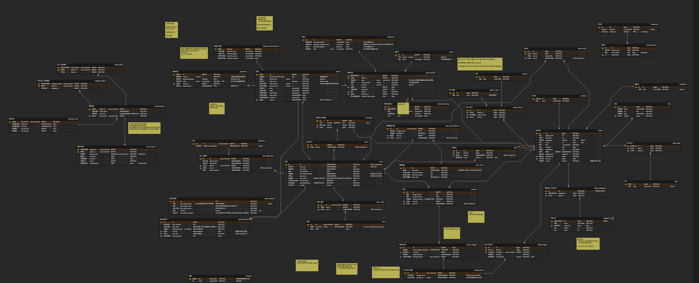

### DB
- [샵DDL코드보기](images/ddl-shop.sql)
- [쿠폰DDL코드보기](images/ddl-coupon.sql)

## 3. 아키텍처
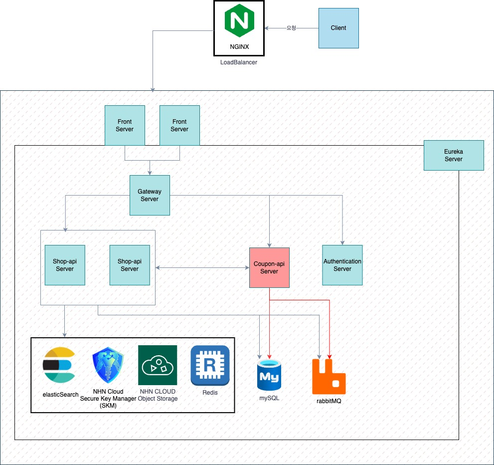

**네트워크 설계**
- Spring Gateway가 각 서버를 효율적으로 찾아가기 위해 Spring Eureka를 사용하여 서버의 내부 정보를 캐싱하여 네트워크를 설계하였습니다.
**인증**
- 여러 서버에서 같은 토큰으로 인증을 관리하기 위해서 JWT 토큰을 도입하였습니다.

## 4. CI/CD
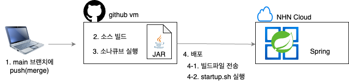
- 코드가 main에 머지됐을 때 ci/cd 깃 액션이 반응하게 파이프라인을 설계했습니다.
- 코드가 develop push, pr, main pr이 됐을 때 ci 깃 액션이 반응하게 파이프라인을 설계했습니다.
- 프론트, 샵 서버는 배포 빈도가 높기 떄문에 스크립트를 작성하여 무중단 배포를 구현하였습니다.

## 5. 프로젝트 관리
체계적이고 효율적인 관리를 위해, [Github Project](https://github.com/orgs/nhnacademy-be8-5rora/projects/1)을 활용하여 프로젝트를 진행하였습니다.

### BackLog, RoadMap 활용
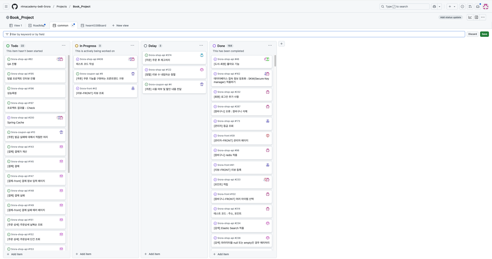
매일 10:00에 RoadMap과 BackLog를 활용하여 스크럼 회의를 진행했습니다.

### Scrum
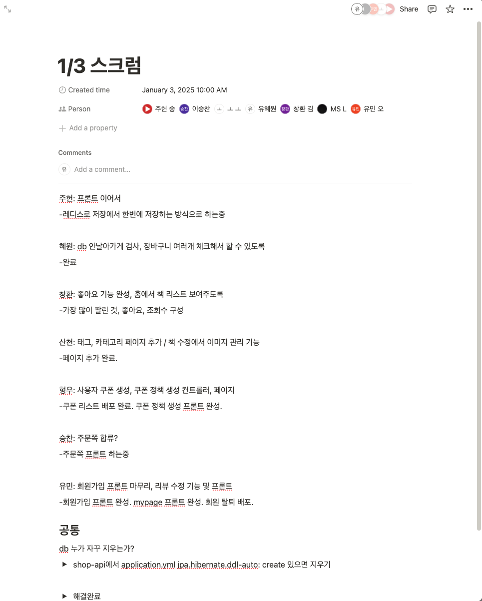

- 스크럼은 평일, 하루에 한 번씩 진행하였습니다.

### Issue관리
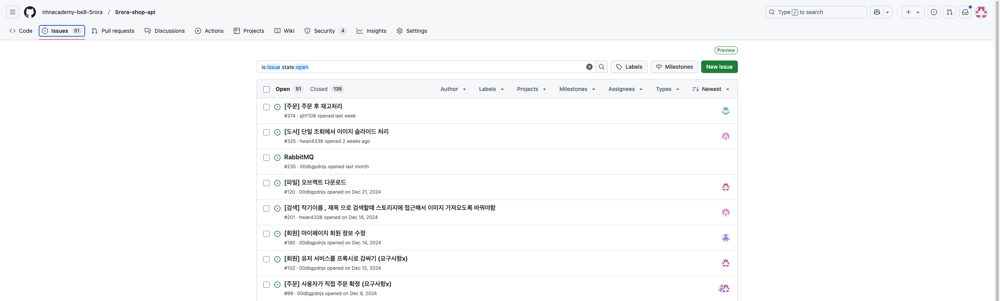
개발시 Issue가 나왔을때 Issue관리를 통해서 해결하였습니다.

### Manage
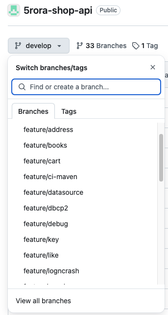
- git flow branch 전략은 main/develop/feature로 나누어 개발을 하였습니다.
- feature는 각각 기능을 만들때 사용하였고
- develop은 기능이 완료되고 확인이 되었을때 pr을 올려 merge를 진행했습니다.
- main은 배포시에 merge를 진행하였습니다.

### PR, CodeReview
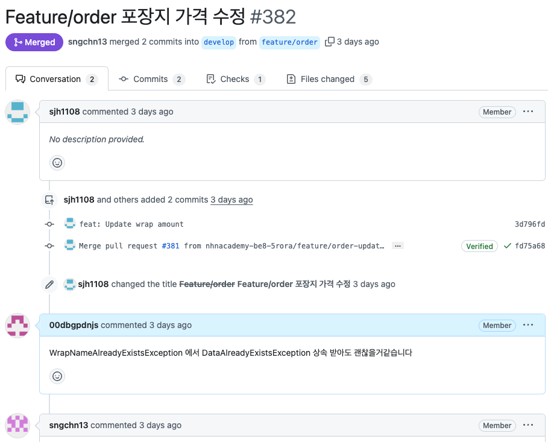
- PR로 올려 팀원들이 코드리뷰를 진행하였습니다.

### 일정관리 - WBS
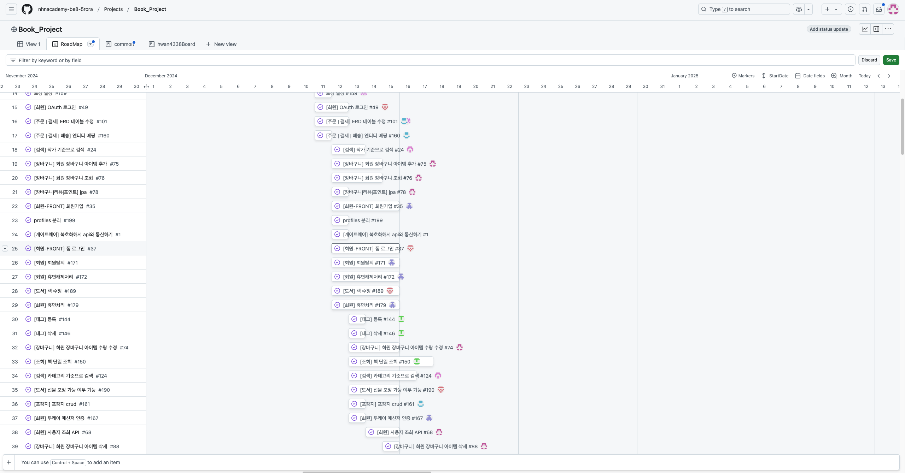
- 일정은 도서, 주문, 회원, 쿠폰 파트로 나누어서 일정을 관리하였습니다.

## 6. 테스트 커버리지

### 샵 API 서버 테스트 커버리지
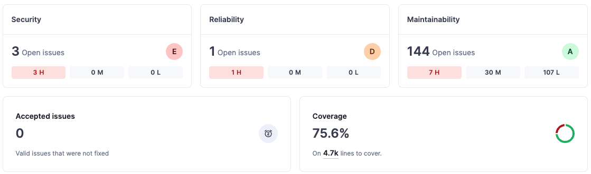

### 쿠폰 API 서버 테스트 커버리지
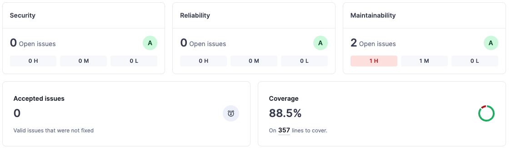

### 인증 API 서버 테스트 커버리지
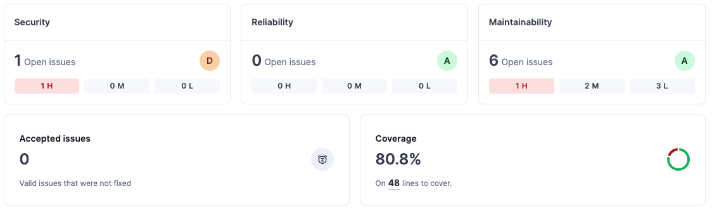

## 7. REST API Specification
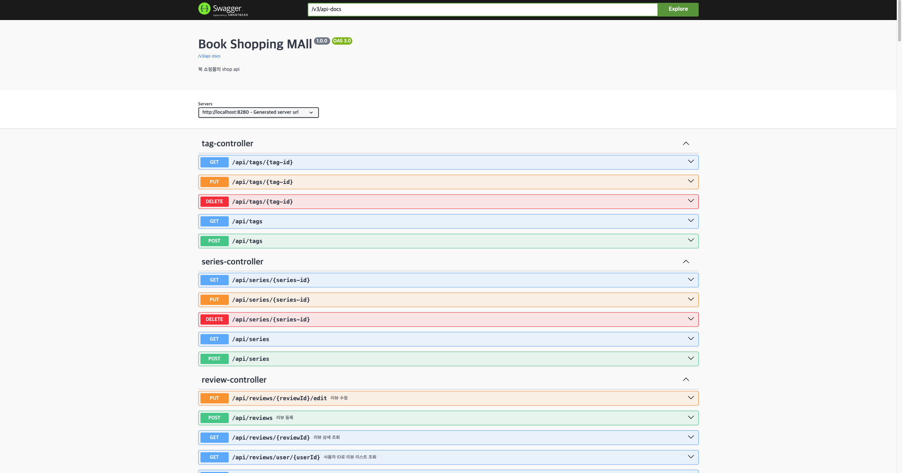

