# 오로라 (5rora)
배포 사이트 들어가기 : https://5rora.store/

### 시연 영상 보기

### 서버별 소스 리포지토리 경로
- [front 서버](https://github.com/nhnacademy-be8-5rora/sustain-5rora-front)
- [shop-api 서버](https://github.com/nhnacademy-be8-5rora/sustain-5rora-shop-api)
- [coupon-api 서버](https://github.com/nhnacademy-be8-5rora/sustain-5rora-coupon-api)
- [auth-api 서버](https://github.com/nhnacademy-be8-5rora/sustain-5rora-authentication-api)
- [gateway 서버](https://github.com/nhnacademy-be8-5rora/sustain-5rora-gateway)
- [eureka 서버](https://github.com/nhnacademy-be8-5rora/sustain-5rora-eureka)

## 1. 팀원

  

    <h3 class="heading-element" dir="auto"> NHN Academy 8기 - 5rora 팀 </h3>
    
  

  <markdown-accessiblity-table data-catalyst="">
    <table>
      <thead>
        <tr>
          <th><a href="https://github.com/00dbgpdnjs"> 유혜원</a></th>
          <th><a href="https://github.com/bang9878"> 방준엽</a></th>
          <th><a href="https://github.com/ksc4305"> 강산천</a></th>
          <th><a href="https://github.com/hwan4338"> 김창환</a></th>
          <th><a href="https://github.com/umin-o">  오유민</a></th>
          <th><a href="https://github.com/adffdfewqefw">  김형우</a></th>
          <th><a href="https://github.com/sngchn13">  이승찬</a></th>
          <th><a href="https://github.com/sjh1108">  송주헌</a></th>
        </tr>
      </thead>
    </table>
</markdown-accessiblity-table>

  

## 2. ERD
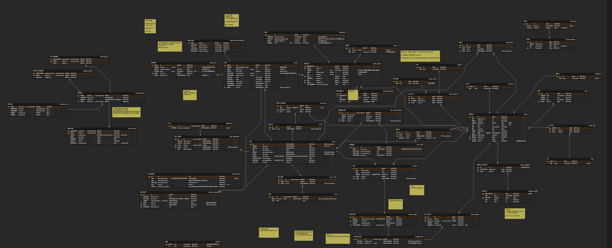

### DB
- [샵DDL코드보기](images/ddl-shop.sql)
- [쿠폰DDL코드보기](images/ddl-coupon.sql)

## 3. 아키텍처
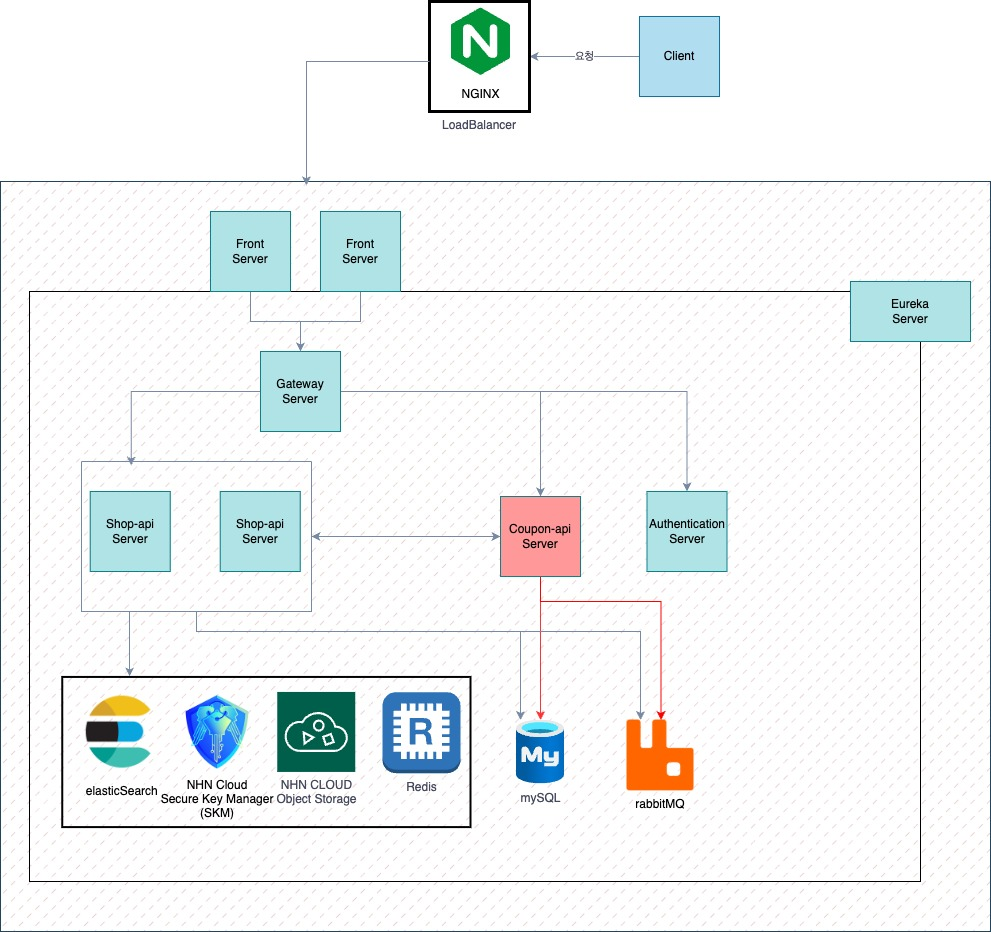

**네트워크 설계**
- Spring Gateway가 각 서버를 효율적으로 찾아가기 위해 Spring Eureka를 사용하여 서버의 내부 정보를 캐싱하여 네트워크를 설계하였습니다.
**인증**
- 여러 서버에서 같은 토큰으로 인증을 관리하기 위해서 JWT 토큰을 도입하였습니다.

## 4. CI/CD
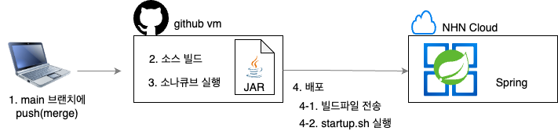
- 코드가 main에 머지됐을 때 ci/cd 깃 액션이 반응하게 파이프라인을 설계했습니다.
- 코드가 develop push, pr, main pr이 됐을 때 ci 깃 액션이 반응하게 파이프라인을 설계했습니다.
- 프론트, 샵 서버는 배포 빈도가 높기 떄문에 스크립트를 작성하여 무중단 배포를 구현하였습니다.

## 5. 프로젝트 관리
체계적이고 효율적인 관리를 위해, [Github Project](https://github.com/orgs/nhnacademy-be8-5rora/projects/1)을 활용하여 프로젝트를 진행하였습니다.

### BackLog, RoadMap 활용
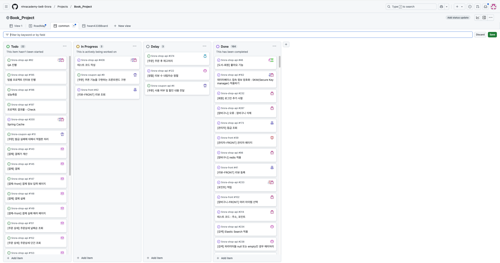
매일 10:00에 RoadMap과 BackLog를 활용하여 스크럼 회의를 진행했습니다.

### Scrum
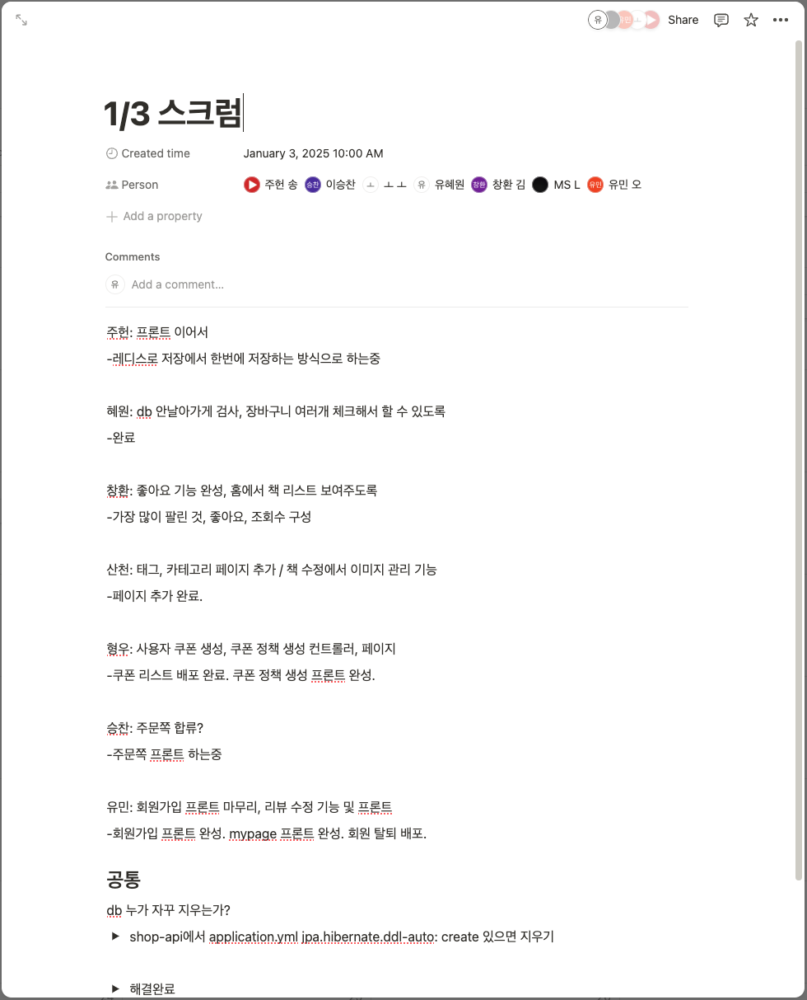

- 스크럼은 평일, 하루에 한 번씩 진행하였습니다.

### Issue관리
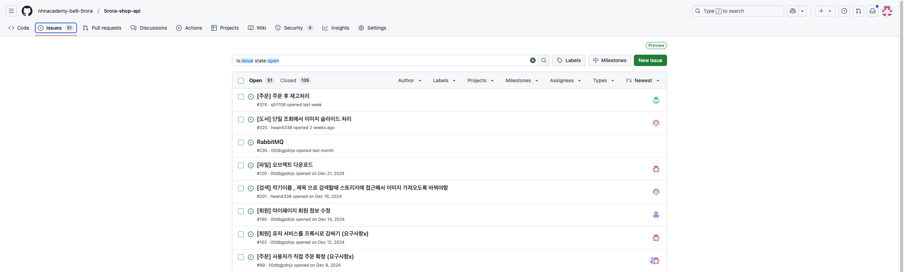
개발시 Issue가 나왔을때 Issue관리를 통해서 해결하였습니다.

### Manage
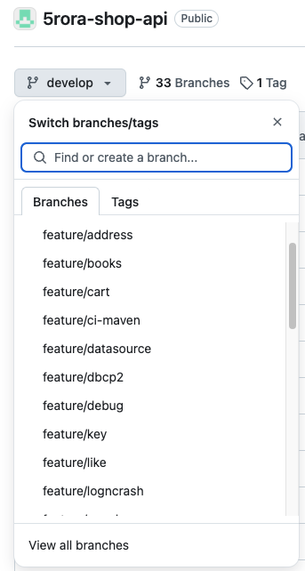
- git flow branch 전략은 main/develop/feature로 나누어 개발을 하였습니다.
- feature는 각각 기능을 만들때 사용하였고
- develop은 기능이 완료되고 확인이 되었을때 pr을 올려 merge를 진행했습니다.
- main은 배포시에 merge를 진행하였습니다.

### PR, CodeReview
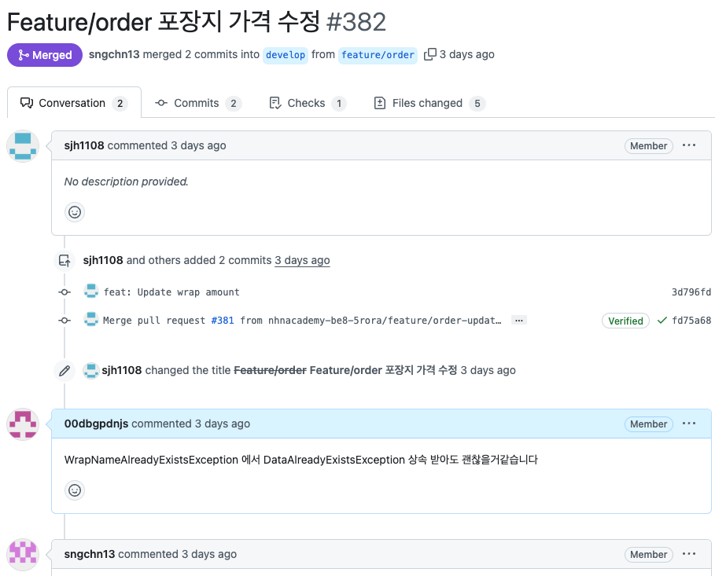
- PR로 올려 팀원들이 코드리뷰를 진행하였습니다.

### 일정관리 - WBS

- 일정은 도서, 주문, 회원, 쿠폰 파트로 나누어서 일정을 관리하였습니다.

## 6. 테스트 커버리지

### 샵 API 서버 테스트 커버리지
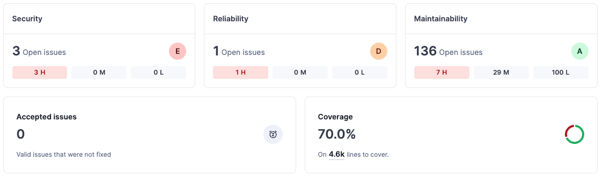

### 쿠폰 API 서버 테스트 커버리지
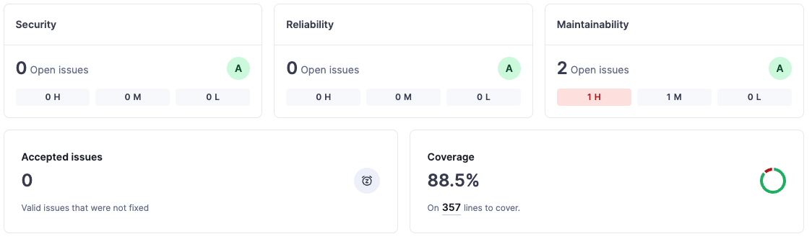

### 인증 API 서버 테스트 커버리지
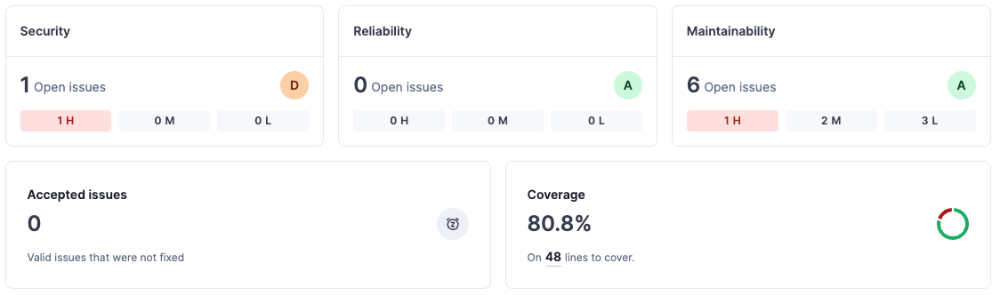

## 7. REST API Specification
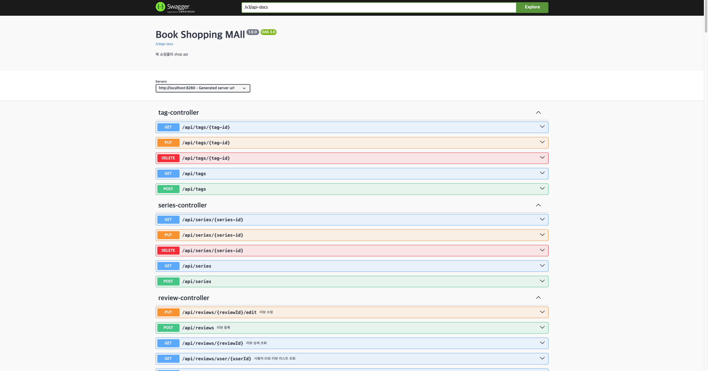
- Spring REST DOC을 사용하여 API 명세서를 만든 후 Swagger UI를 사용하였습니다.

## 8. 업무 분담 및 주요기능

### 강산천
#### 담당
- 관리자
  - 관리자 페이지 레이아웃 분리
  - 도서 직접 등록 구현
  - 알라딘 api를 이용한 도서 검색 및 등록 구현
  - 알라딘 api로 검색한 데이터 redis에 저장
  - 도서 등록 시 설명란 TUI Editor 적용
  - 도서 정보 수정 구현
  - 도서 soft 삭제 -> 활성화/비활성화 구현
  - 도서 목록 구현(활성화/비활성화 분리, page 처리)
  - 카테고리, 태그, 출판사, 저자(역할), 시리즈 CRUD(page 처리)
- 이미지 관리
  - NHN Object Storage를 이용하여 도서 이미지 관리(CRUD)
  - NHN Object Storage 접근 토큰 발급 키 -> NHN Secure Key Manager 적용
  - NHN Object Storage 토큰 만료 전 자동 발급 구현

### 유혜원
#### 담당
- 인증/인가
  - JWT 토큰 발급 구현
  - 토큰 재발급 구현
  - 토큰 활용 사용자 정보 api 전달 구현
- 장바구니
  - 장바구니 조회, 등록, 수정, 삭제 api 구현
  - redis 적용
  - 장바구니 view 구현
- 회원
  - 배송지 관리 view 구현
  - 배송지 등록, 조회, 수정, 삭제 api 구현
  - 등급 별 혜택 조회 api 및 view 구현
- 포인트
  - 회원 가입, 리뷰, 주문 시 적립 및 포인트 사용 구현
  - 포인트 내역 조회 api 및 view 구현
  - 포인트 정책 비활성화, 조회, 수정 api 구현 및 view 구현
- 그 외
  - nhn cloud obejct storage를 이용한 파일 업로드 구현
  - api 서버 이중화 및 무중단 배포 구현

### 김창환
#### 담당
- 도서 조회
  - 검색 결과 페이지 view 구현
  - 도서 조회 api 구현
    - 제목으로 조회
    - 작가이름으로 조회
    - 카테고리로 조회
    - 태그로 조회
    - 특정 정렬 기준 적용 (신상품 , 최저가 , 최고가 , 리뷰수 , 평점(리뷰100건이상))
- Elastic 적용
  - full-text 검색
  - 형태소 분석기 다양화 (standard 및 ngram 등)
- 좋아요
  - 좋아요 기능 구현 (회원만 가능)
  - 마이페이지에서 유저가 좋아요 누른 책 리스트 조회

### 김형우
#### 담당
- 관리자
  -  관리자 페이지 레이아웃, css 적용
  -  관리자 페이지 기능 연결
  -  쿠폰 정책 구현
    - 통합 쿠폰 정책 등록
    - 카테고리/북 정책 등록
    - 계산 정책 등록 
  - 사용자 쿠폰
    - 사용자 쿠폰 등록, 수정 api 구현 및 view 페이지 구현
  - 상품 결제 및 환불시 사용된 쿠폰 상태 변경 api 구현
- 회원
  - 현재 소지한 쿠폰 조회 및 쿠폰 사용 내역 조회 구현
  - 조회한 내용 레이아웃, 페이지 구현
  - 사용자 생일 쿠폰 자동 지급 구현
  - 사용자 회원가입시 Welcome 쿠폰 자동 지급 구현
  - 쿠폰 발행 실패시 재발급 기능 구현

### 송주헌
#### 담당
- 관리자
  - 관리자 페이지 기능 연결
  - 포장 정책
    - 포장 정책 crud api 구현
    - 포장 정책 관리 view 페이지 구현, css 등 적용
  - 주문 관리
    - 배송 시작 후 일정 시간 이후 자동으로 배송완료 되는 로직 구현
    - view 페이지 구현
  - 배송비 정책
- 주문
  - 주문 관련 entity 및 관련 crud api 작성
  - 주문 프로세스 api 작성
    - 책 판매가, 배송비 등 합산하여 결제 금액 계산 및 주문 데이터 저장 로직 작성

### 오유민
#### 담당
- 회원
  - 일반 회원가입 api 구현 및 view 구현
  - OAuth 회원가입 api 구현
  - 회원 탈퇴 api 구현 및 view 구현
  - 회원 정보 조회 api 구현 및 마이페이지 view 구현
  - 회원 정보 수정 api 구현 및 view 구현
  - 휴면계정 처리/해제 api 구현 view 구현
  - redis를 이용한 두레이 메신저 인증 api 구현
  - 회원 등급 업데이트 스케줄링 활용 구현
- 리뷰
  - 리뷰 조회, 등록, 수정 api 구현
  - 리뷰 조회, 등록, 수정 view 구현
- 암호화
  - NHN Cloud Secure Key Manager을 적용하여 정보를 안전하게 보호

### 이승찬
#### 담당
- 주문
  - 주문 페이지
  - 환불 페이지, 환불 기능
  - 주문 취소 페이지 , 주문 취소 
- 로그인
  - 일반 로그인
  - 페이코 로그인
- 로그
  - nhn log & crash 적용

## 기술
- Spring
  Spring, Spring Boot, Spring Security, Spring Cloud

- DB
  Redis, MySql

- CI/CD
  Github Actions, NHNCloud, Nginx, Ubuntu

- Search
  Elastic, kibana

- 그 외 기술
  JavaScript, HTML5, CSS3, JAVA, Hibernate, JPA, QueryDsl
  SonarQube, JWT, RabbitMQ, Toss Payments, Swagger

   

